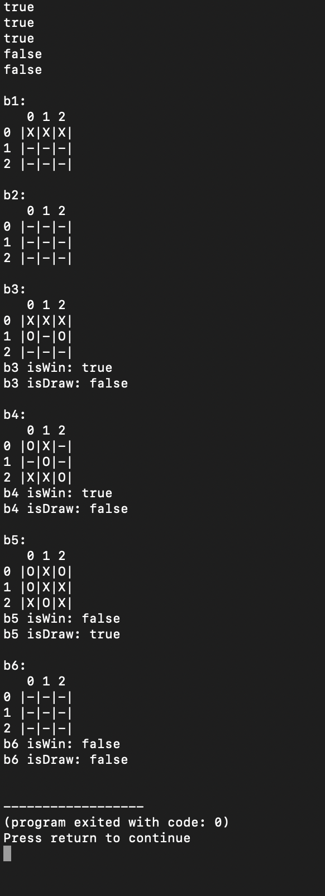

# Tic-Tac-Toe
This program uses Java and JavaAWT to create a functional game of Tic Tac Toe. 

## Getting Started
Clone the repository  

Run TicTacToeGame.java

A new window should open, click 'Start Game' and then tic tac toe can be played with all of the traditional rules. The 'Reset Game' button can be used to restart the game at any point and the 'Start Game' button must be clicked to play a new game.

## Running Tests
Run TicTacToeTest.java. This program will test various scenarios within the game which could produce problems within the code. The program should produce the following results 

